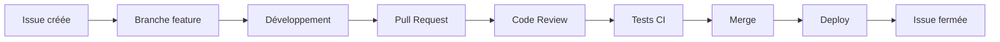

🔝 Retour au [Sommaire](/SOMMAIRE.md)

# 8. Collaboration Avancée

## Introduction

La collaboration est au cœur de GitHub et constitue l'un des aspects les plus puissants de la plateforme. Au-delà des fonctionnalités de base comme les pull requests et les issues, GitHub offre un écosystème riche d'outils de collaboration qui permettent aux équipes de travailler ensemble efficacement, peu importe leur taille ou leur répartition géographique.

Dans cette section, nous allons explorer les fonctionnalités avancées de collaboration disponibles via la CLI GitHub, vous permettant de gérer des équipes, coordonner des projets complexes, et créer des workflows de collaboration optimisés.

## Qu'est-ce que la collaboration avancée ?

### Définition

La **collaboration avancée** va au-delà du simple partage de code. Elle englobe :

- 👥 **Gestion d'équipes** avec rôles et permissions
- 🔔 **Communication structurée** via notifications et mentions
- 📋 **Organisation de projets** avec templates et workflows
- 🔗 **Intégration d'outils** externes et automatisations
- 📊 **Suivi et métriques** de collaboration

### Évolution de la collaboration

**Collaboration traditionnelle :**
- Email pour communiquer
- Partage de fichiers manuel
- Réunions pour coordination
- Documentation dispersée

**Collaboration moderne avec GitHub :**
- Discussion contextuelle sur le code
- Workflow automatisé et transparent
- Historique complet et tracé
- Collaboration asynchrone efficace

## Écosystème de collaboration GitHub

### Composants principaux

**🏢 Organizations & Teams :**
- Structure hiérarchique des équipes
- Gestion granulaire des permissions
- Politiques de sécurité centralisées

**🎯 Projects & Milestones :**
- Planification et suivi de projets
- Tableaux kanban intégrés
- Métriques et rapports automatiques

**📝 Issues & Discussions :**
- Communication structurée
- Templates personnalisés
- Système de labels et assignations

**🔔 Notifications & Mentions :**
- Système intelligent de notifications
- Mentions contextuelles
- Paramétrage fin des alertes

### Intégrations natives

GitHub s'intègre naturellement avec :
- **Slack/Discord** : Notifications temps réel
- **Jira/Trello** : Synchronisation des tâches
- **Figma/Adobe XD** : Review de designs
- **VS Code** : Collaboration en direct

## Pourquoi utiliser la CLI pour la collaboration ?

### Avantages de l'approche CLI

**⚡ Efficacité :**
- Actions rapides sans quitter le terminal
- Scripts d'automatisation pour tâches répétitives
- Intégration dans les workflows de développement

**🔧 Personnalisation :**
- Configuration fine des permissions
- Création de templates réutilisables
- Automatisation des processus d'équipe

**📊 Visibilité :**
- Métriques et rapports en ligne de commande
- Surveillance des activités d'équipe
- Audit des permissions et accès

**🚀 Scalabilité :**
- Gestion d'équipes de toute taille
- Opérations en lot sur plusieurs repositories
- Standardisation des processus

## Types de collaboration selon l'équipe

### Équipes de développement

**Défis typiques :**
- Coordination entre développeurs
- Review de code efficace
- Gestion des releases communes

**Solutions CLI :**
```bash
# Assignation automatique de reviewers
gh pr create --reviewer @team/backend,@john-doe

# Synchronisation des branches d'équipe
gh repo sync upstream/main

# Métriques de review
gh pr list --reviewer @me --state merged
```

### Équipes produit

**Défis typiques :**
- Coordination dev/design/product
- Suivi des fonctionnalités
- Communication avec les stakeholders

**Solutions CLI :**
```bash
# Création d'issues avec templates
gh issue create --template feature-request

# Mise à jour de projets
gh project item-add 123 --url https://github.com/repo/issues/456

# Rapports de statut
gh issue list --milestone "Sprint 12" --json state,title
```

### Équipes open source

**Défis typiques :**
- Gestion des contributions externes
- Modération des discussions
- Coordination des mainteneurs

**Solutions CLI :**
```bash
# Gestion des contributions
gh pr list --author @external-contributor

# Modération des issues
gh issue close 123 --reason "not planned"

# Communication avec contributeurs
gh issue comment 123 --body "Merci pour votre contribution !"
```

## Patterns de collaboration efficace

### Workflow de feature développement



**Mise en œuvre CLI :**
```bash
# 1. Créer issue et branche
gh issue create --title "Nouvelle fonctionnalité X"
gh issue develop 123 --checkout

# 2. Développement et PR
git commit -m "feat: ajout fonctionnalité X"
gh pr create --fill

# 3. Review et merge
gh pr review --approve
gh pr merge --squash
```

### Communication asynchrone

**Principes :**
- Contexte permanent via issues/PR
- Mentions ciblées pour réduire le bruit
- Documentation des décisions

**Outils CLI :**
```bash
# Mentions contextuelles
gh issue comment 123 --body "Cc @team/frontend pour review du design"

# Notifications personnalisées
gh api notifications --method PUT --field read=true

# Historique des décisions
gh issue list --label "decision" --state closed
```

## Architecture de collaboration

### Structure organisationnelle

**Repository principal :**
- Code source
- Issues de bugs/features
- Discussions techniques

**Repository de documentation :**
- Wiki collaboratif
- Guides et tutorials
- Décisions architecturales

**Repository de gestion :**
- Templates d'équipe
- Scripts d'automatisation
- Politiques et processus

### Flux d'information

```
Développeurs ←→ Issues/PR ←→ Project Boards
     ↓              ↓              ↓
Notifications → Discussions → Decisions
     ↓              ↓              ↓
   Slack      →  Wiki      →  Documentation
```

## Métriques de collaboration

### Indicateurs clés

**Participation :**
- Nombre de contributeurs actifs
- Fréquence des contributions
- Répartition des reviews

**Qualité :**
- Temps de résolution des issues
- Taux d'acceptation des PR
- Couverture des reviews

**Efficacité :**
- Temps de cycle des features
- Nombre d'itérations par PR
- Délai de première réponse

### Outils de mesure

```bash
# Métriques de contribution
gh api repos/:owner/:repo/stats/contributors

# Analyse des PR
gh pr list --state merged --json mergedAt,reviews

# Activité des issues
gh issue list --state closed --json closedAt,createdAt
```

## Défis courants et solutions

### Communication dispersée

**Problème :** Informations éparpillées entre différents canaux.

**Solution :** Centralisation via GitHub avec intégrations.
```bash
# Lier discussions Slack aux issues
gh issue create --body "Discussion Slack: [lien]"

# Notifications centralisées
gh api notifications --jq '.[] | select(.unread==true)'
```

### Surcharge de notifications

**Problème :** Trop de notifications tuent la productivité.

**Solution :** Configuration fine et filtrage intelligent.
```bash
# Configuration personnalisée
gh api user/subscriptions --method PUT --field subscribed=false

# Filtrage par équipe
gh notification list --reason team_mention
```

### Coordination de releases

**Problème :** Difficulté à coordonner les releases multi-équipes.

**Solution :** Processus standardisé avec CLI.
```bash
# Release coordinée
gh release create v1.0.0 --generate-notes
gh issue close --reason completed 123 456 789

# Communication automatique
gh api repos/:owner/:repo/releases/latest --jq '.body' | \
  slack-notifier "#releases"
```

## Prérequis pour cette section

Avant de continuer, assurez-vous d'avoir :

- ✅ Maîtrise des concepts de base (issues, PR, repos)
- ✅ Compréhension des workflows Git
- ✅ Accès à une organisation GitHub (ou possibilité d'en créer une)
- ✅ Permissions d'administration sur au moins un repository
- ✅ CLI GitHub configurée avec les bonnes permissions

> 💡 **Note** : Certaines fonctionnalités avancées nécessitent des permissions d'organisation ou d'administration. Si vous n'en avez pas, vous pouvez suivre conceptuellement et appliquer les techniques sur vos repositories personnels.

## Outils complémentaires

### Extensions CLI recommandées

```bash
# Installation d'extensions utiles pour la collaboration
gh extension install github/gh-copilot    # Assistant IA
gh extension install mislav/gh-branch     # Gestion de branches
gh extension install dlvhdr/gh-dash       # Dashboard terminal
```

### Intégrations tierces

**Slack :**
```bash
# Configuration webhook Slack
gh api repos/:owner/:repo/hooks --method POST \
  --field name=web \
  --field config[url]=$SLACK_WEBHOOK_URL
```

**Discord :**
```bash
# Bot GitHub pour Discord
gh api repos/:owner/:repo/hooks --method POST \
  --field name=discord \
  --field config[url]=$DISCORD_WEBHOOK_URL
```

## Ce que vous allez apprendre

Dans les sections suivantes, vous maîtriserez :

- **8.1** : Gérer les équipes, rôles et permissions de manière granulaire
- **8.2** : Optimiser les notifications et utiliser les mentions efficacement
- **8.3** : Créer et utiliser des templates pour standardiser les processus
- **8.4** : Intégrer GitHub avec vos projets et outils de gestion

Ces compétences vous permettront de transformer votre façon de collaborer et de créer des équipes plus productives et mieux coordonnées.

## Vision de la collaboration moderne

### Objectifs à atteindre

**🎯 Transparence totale :**
- Toutes les décisions documentées et tracées
- Visibilité complète sur l'avancement des projets
- Accès facile à l'historique et au contexte

**⚡ Efficacité maximale :**
- Réduction des réunions grâce à la collaboration asynchrone
- Automatisation des tâches répétitives
- Workflows optimisés pour chaque type d'équipe

**🚀 Scalabilité native :**
- Processus qui s'adaptent à la croissance de l'équipe
- Standards réutilisables entre projets
- Formation simplifiée des nouveaux membres

Prêt à révolutionner votre collaboration d'équipe ? Plongeons dans les techniques avancées ! 🚀


⏭️
